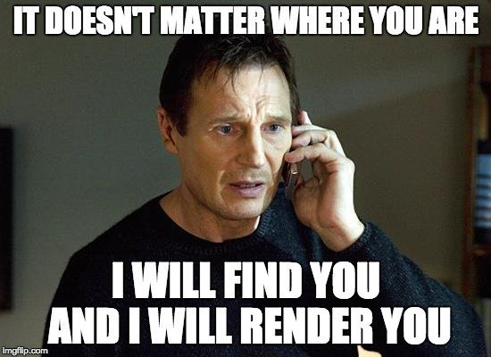

# 0x01. React intro

- Author: Thapelo M Moumakoe
- Language: `JavaScript` (`ES6`)
- Subjects: `Front-end` & `React`

This project is an introductory lesson to React, a JavaScript library for web and native user interfaces

